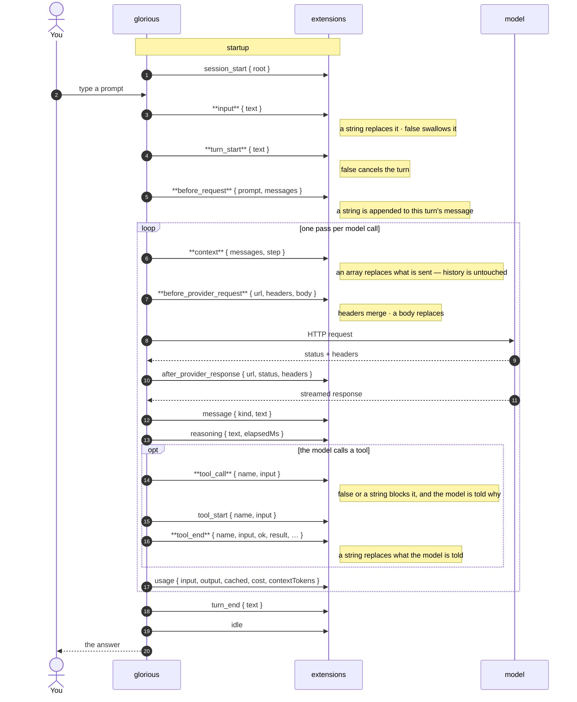
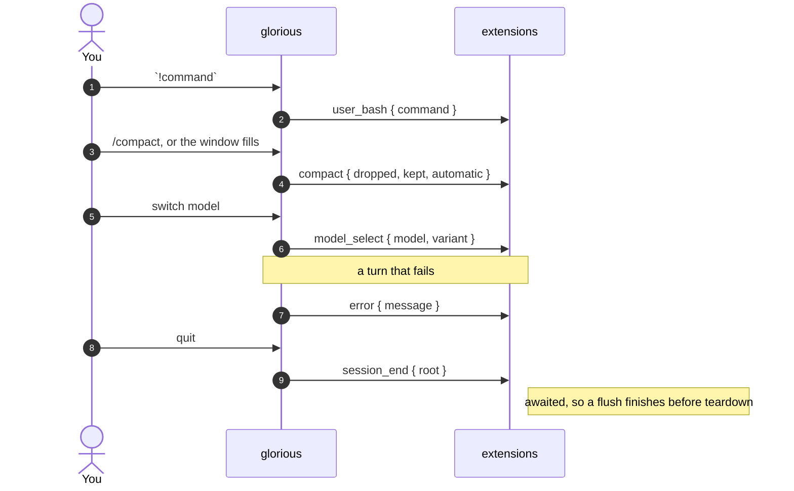

# Lifecycle

Every event an extension can subscribe to, in the order it fires. Names in
**bold** can change what happens next; the rest are notifications.

Both hosts fire everything here except four events that have no meaning without
a composer — `input`, `user_bash`, `model_select` and `compact`. A test enforces
that, so this page cannot drift from the code.

## A turn, end to end

## Everything else

## What each one is for

| Event | Fires | Returning something |
| --- | --- | --- |
| `session_start` | once, before the first turn | — |
| `session_end` | on the way out | — (awaited) |
| `input` | you pressed Enter | a string replaces it; `false` swallows it |
| `user_bash` | you ran `!command` | — |
| `turn_start` | a turn is starting | `false` cancels it |
| `before_request` | before the model is called | a string is appended to this turn's message |
| `context` | before **each** model call | an array replaces the messages for that call |
| `before_provider_request` | before the HTTP request | `{ headers }` merges, `{ body }` replaces |
| `after_provider_response` | headers arrived, body not yet read | — |
| `message` | text and reasoning, as they stream | — |
| `reasoning` | the model stopped thinking | — |
| `tool_call` | before a tool runs | `false` or a string blocks it |
| `tool_start` | the tool is running | — |
| `tool_end` | the tool returned | a string replaces what the model is told |
| `usage` | once per model call | — |
| `turn_end` | the turn produced its answer | — |
| `idle` | nothing running, nothing queued | — |
| `error` | the turn failed | — |
| `model_select` | the model changed | — |
| `compact` | the conversation was summarised | — |

## Three that are easy to confuse

- **`before_request` appends, `context` replaces.** `before_request` fires once per turn and adds a string to the message you sent. `context` fires once per *model call* — a turn running three tools fires it four times — and hands you every message, so it is where filtering, windowing and redaction go. Neither changes stored history: `context` changes only what that one call sends.
- **`tool_call` refuses, `filterTools` withholds.** A refusal reaches the model with your reason, which is what you want when the answer depends on the arguments. A filter removes the tool from the schema, so the model never knew it existed. Withholding cannot be argued with.
- **`before_provider_request` is the last word.** It sees the payload exactly as the provider will, after everything else has run. A gateway, a signing proxy, per-request auth and request logging all live there.
